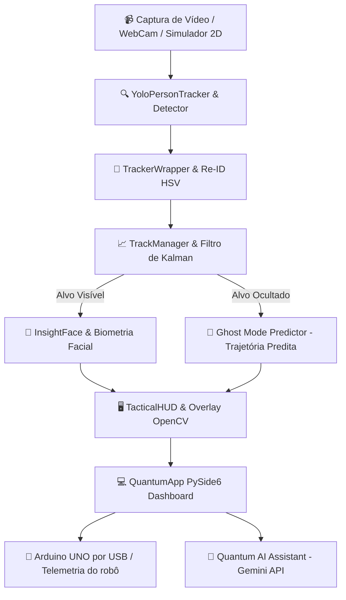

<div align="center">

  # ⚡ QUANTUM TRACKER
  ### Sistema Avançado de Rastreamento Tático & Reconhecimento por IA

  [](https://www.python.org/)
  [](https://pypi.org/project/PySide6/)
  [](https://github.com/ultralytics/ultralytics)
  [](https://opencv.org/)
  [](https://ai.google.dev/)
  [](https://github.com/jgouveaf/FECART)

  <p align="center">
    <b>Plataforma de Visão Computacional, Rastreamento Multialvo, Filtro de Kalman, Ghost Mode Predictor e Controle de Robótica Móvel.</b>
    <br />
    <i>Desenvolvido por <b>João</b> · <b>Gustavo</b> · <b>Renato</b> para a <b>FECART</b>.</i>
  </p>

  <p align="center">
    <a href="https://jgouveaf.github.io/FECART/"><b>Abrir painel web</b></a> •
    <a href="#-estrutura-do-projeto"><b>Estrutura de Código</b></a> •
    <a href="#-como-rodar-desenvolvimento"><b>Como Rodar</b></a> •
    <a href="#-como-gerar-o-exe-port%C3%A1til"><b>Gerar .EXE</b></a> •
    <a href="#-como-colaborar"><b>Como Colaborar</b></a> •
    <a href="#-arquitetura-do-sistema"><b>Arquitetura</b></a>
  </p>

</div>

---

## Painel web e Arduino UNO

O painel web atual funciona em navegador Chromium compatível e conecta diretamente ao **Arduino UNO por cabo USB/Web Serial**. O firmware ativo usa L298N e HC-SR04 nos pinos IN1 D7, IN2 D6, IN3 D5, IN4 D4, TRIG D3 e ECHO D2.

Por segurança, conectar o cabo **não inicia os motores**: o handshake termina em ESTOP e exige o clique explícito em **“Liberar após conferir”**.

- Painel publicado: <https://jgouveaf.github.io/FECART/>
- Firmware: `firmware/quantum_tracker_arduino/quantum_tracker_arduino.ino`
- Guia Arduino + site: `docs/GUIA_TECNICO_ARDUINO_SITE.md`
- Tutorial completo do painel: `docs/TUTORIAL_PAINEL_WEB.md`
- Revisão de qualidade: `docs/REVISAO_QUALIDADE_2026-09-01.md`
- Relatório da revisão: `docs/RELATORIO_REVISAO_WEB_CAMERA_GESTOS.md`

O Arduino IDE 2.3.10 é usado somente uma vez para gravar o firmware (ou quando
houver atualização). Depois disso, o código continua salvo no UNO: feche o IDE
e o Monitor Serial, conecte o cabo USB e controle os modos pelo painel web. O
site envia comandos seriais; ele não recompila nem substitui o sketch.

Não abra `index.html` por duplo clique (`file:///`): navegadores bloqueiam os módulos, modelos e WASM usados pelo FaceID e pelos gestos. A página detecta esse caso e encaminha para o painel HTTPS. Para desenvolvimento local, sirva a pasta por HTTP, por exemplo com `python -m http.server 8765`, e abra `http://127.0.0.1:8765/`.

> O controle físico usa exclusivamente Arduino UNO por USB, a 9600 baud, com o protocolo Quantum Tracker V5.

---

## 📌 Sumário Navegável

1. [🎯 Destaques do Sistema](#-destaques-do-sistema)
2. [📁 Estrutura do Projeto (Árvore Completa)](#-estrutura-do-projeto)
3. [🚀 Como Rodar (Desenvolvimento Passo a Passo)](#-como-rodar-desenvolvimento)
4. [📦 Como Gerar o Executável Portátil (.exe)](#-como-gerar-o-exe-port%C3%A1til)
5. [🤝 Como Colaborar (Comandos Git)](#-como-colaborar)
6. [🏛️ Arquitetura e Fluxo de Dados](#-arquitetura-do-sistema)
7. [🛠️ Módulos e Responsabilidades](#%EF%B8%8F-m%C3%B3dulos-e-estrutura-dos-componentes)

---

## 🎯 Destaques do Sistema

<table>
  <tr>
    <td width="50%" valign="top">
      <h3>🎯 Rastreamento Kalman & YOLOv8</h3>
      <p>Detecção ultra-rápida de pessoas com inferência otimizada, associação de estados via ByteTrack e previsão contínua de movimento.</p>
    </td>
    <td width="50%" valign="top">
      <h3>👻 Ghost Mode Predictor</h3>
      <p>Quando o alvo é ocultado por obstáculos, o sistema mantém uma <b>caixa tracejada preditiva</b> baseada na dinâmica e vetor de velocidade do robô.</p>
    </td>
  </tr>
  <tr>
    <td width="50%" valign="top">
      <h3>👤 Biometria & Re-ID Facial</h3>
      <p>Reconhecimento facial instantâneo via <b>InsightFace</b> combinado com re-identificação rápida por histogramas de cor HSV.</p>
    </td>
    <td width="50%" valign="top">
      <h3>🤖 Robótica & Simulador 2D</h3>
      <p>Integração do painel web com Arduino UNO via USB/Web Serial e um <b>Simulador Visual 2D interativo</b> com telemetria.</p>
    </td>
  </tr>
  <tr>
    <td width="50%" valign="top">
      <h3>🎯 Treinador Teachable Gestures</h3>
      <p>Gravação de gestos ao vivo via câmera e treinamento de modelos de IA direto na interface para controle por sinais de mão.</p>
    </td>
    <td width="50%" valign="top">
      <h3>🧠 Assistente Quantum AI</h3>
      <p>Integração com <b>Google Gemini API</b> para geração de relatórios táticos de campo, respostas inteligentes e síntese de voz nativa.</p>
    </td>
  </tr>
</table>

---

## 📁 Estrutura do Projeto

Aqui está a árvore completa de diretórios e código do projeto:

```text
FECART/
├── main.py                  # Ponto de entrada do app
├── requirements.txt         # Dependências Python
├── build_exe.py             # Gera o executável .exe portátil
├── yolov8n.pt               # Modelo YOLOv8 nano
│
├── app/                     # Interface gráfica (PySide6)
│   ├── quantum_app.py       # Janela principal e loop do sistema
│   └── splash_screen.py     # Tela de abertura animada (3s)
│
├── tracker/                 # Rastreamento de alvos
│   ├── tracker_wrapper.py   # ByteTrack + Re-ID por histograma (Stable IDs)
│   ├── track_manager.py     # Gerenciamento de estados dos alvos
│   ├── yolo_tracker.py      # Detector YOLOv8 otimizado (threading + FP16)
│   └── kalman_tracker.py    # Filtro de Kalman para predição
│
├── core/                    # Modelos de dados centrais
│   └── models.py
│
├── hud/                     # HUD tático sobreposto ao vídeo
│   └── tactical_hud.py
│
├── recognition/             # Reconhecimento facial (InsightFace)
│   ├── insightface_service.py
│   └── identity_resolver.py
│
├── biometrics/              # Cadastro e leitura de faces
│   └── face_recognition.py
│
├── brain/                   # IA (Gemini), voz e comandos por fala
│   ├── quantum_brain.py
│   ├── tactical_voice.py
│   ├── speech_listener.py
│   └── gemini_assistant.py
│
├── vision/                  # Reconhecimento de gestos das mãos
│   ├── gesture_recognizer.py
│   └── gesture_trainer.py
│
├── robot/                   # Controle legado do app desktop / simulador
│   ├── robot_controller.py
│   ├── robot_state_machine.py
│   └── arduino_usb_adapter.py
│
├── simulator/               # Simulador visual 2D
│   ├── visual_simulator.py  # Arena 2D com robô e predição Ghost Mode
│   └── synthetic_world.py   # Conector do ambiente sintético
│
├── database/                # Banco de dados SQLite local
│   └── database_manager.py
│
├── utils/                   # Configuração e utilitários
│   └── config.py
│
├── assets/                  # Ícones, logos, modelos InsightFace
├── docs/                    # Documentação técnica
├── scripts/                 # Scripts de instalação e execução (.bat)
└── data/                    # Dados do usuário (gerado ao rodar)
    ├── faces/               # Fotos cadastradas
    ├── database/            # Banco SQLite
    └── logs/
```

---

## 🚀 Como Rodar (Desenvolvimento)

> [!IMPORTANT]
> Requer **Python 3.10 ou superior**.

### Opção A: Executar via Scripts Automáticos (Windows)
1. Dê um duplo clique em `1_INSTALAR.bat` para instalar o ambiente virtual e as dependências.
2. Dê um duplo clique em `2_ABRIR.bat` para iniciar o aplicativo.

---

### Opção B: Comandos no Terminal

```bash
# 1. Clonar o repositório
git clone https://github.com/jgouveaf/FECART.git
cd FECART

# 2. Criar ambiente virtual
python -m venv .venv

# 3. Ativar o ambiente virtual
# No Windows:
.venv\Scripts\activate
# No Linux/Mac:
source .venv/bin/activate

# 4. Instalar todas as dependências
pip install -r requirements.txt

# 5. Executar a aplicação
python main.py
```

---

## 📦 Como Gerar o .exe Portátil

Para compilar todo o código e gerar um pacote portátil único com modelos inclusos:

```bash
# 1. Certifique-se de ter o PyInstaller instalado
pip install pyinstaller

# 2. Executar o script automatizado de build
python build_exe.py
```

> [!TIP]
> O executável será gerado em `dist/QuantumTracker_Portable.zip`.
> Dentro do ZIP haverá o arquivo `QuantumTracker.exe` e o `README.txt` com as instruções: *"Extraia e execute QuantumTracker.exe"*.

---

## 🤝 Como Colaborar

Siga os comandos de Git abaixo para sincronizar seu trabalho com a equipe:

```bash
# 1. Baixar atualizações do repositório
git pull origin main

# 2. Após modificar seus arquivos no projeto:
git add .

# 3. Criar o commit descrevendo o que você fez
git commit -m "Minha contribuição no módulo X"

# 4. Enviar as alterações para o GitHub
git push origin main
```

---

## 🏛️ Arquitetura do Sistema



---

## 🛠️ Módulos e Estrutura dos Componentes

| Módulo | Descrição do Componente | Responsabilidade Principal |
| :--- | :--- | :--- |
| **`app/`** | `quantum_app.py`, `splash_screen.py` | Interface principal PySide6, ciclo da Splash Screen animada (3s) e estilização Glassmorphic. |
| **`simulator/`** | `visual_simulator.py`, `synthetic_world.py` | Arena 2D interativa com robô direcional, targets móveis e predição tracejada Ghost Mode. |
| **`tracker/`** | `tracker_wrapper.py`, `kalman_tracker.py` | Rastreamento multialvo, estimativa de estado, cálculo de velocidade e visual Re-ID. |
| **`hud/`** | `tactical_hud.py` | Visualizador HUD tático OpenCV com brquetes de canto, mira e cartões transparentes. |
| **`biometrics/`**| `face_recognition.py`, `identity_resolver.py` | Extração de vetores faciais (embeddings) e resolução de banco de identidades. |
| **`robot/`** | `robot_controller.py`, `arduino_usb_adapter.py` | Controle do Arduino UNO por USB/Web Serial no protocolo V5. |
| **`brain/`** | `quantum_brain.py`, `gemini_assistant.py` | Assistente inteligente Gemini, processamento de síntese de voz e relatórios. |

---

## 👥 Autores & Créditos

<div align="center">
  <table>
    <tr>
      <td align="center"><b>João</b></td>
      <td align="center"><b>Gustavo</b></td>
      <td align="center"><b>Renato</b></td>
    </tr>
  </table>
  <br>
  <i>Desenvolvido para a <b>FECART</b> · 2026. Todos os direitos reservados.</i>
</div>
