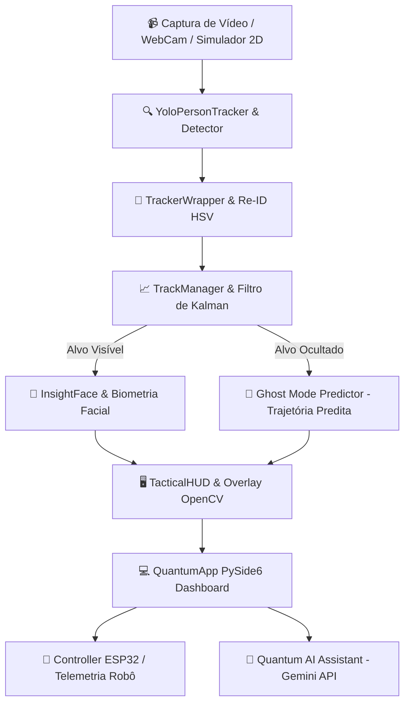

<div align="center">

  # ⚡ QUANTUM TRACKER
  ### Sistema Avançado de Rastreamento Tático & Reconhecimento por IA

  [](https://www.python.org/)
  [](https://pypi.org/project/PySide6/)
  [](https://github.com/ultralytics/ultralytics)
  [](https://opencv.org/)
  [](https://ai.google.dev/)
  [](https://github.com/jgouveaf/FECART)

  <p align="center">
    <b>Plataforma de Visão Computacional, Rastreamento Multialvo, Filtro de Kalman, Ghost Mode Predictor e Controle de Robótica Móvel.</b>
    <br />
    <i>Desenvolvido por <b>João</b> · <b>Gustavo</b> · <b>Renato</b> para a <b>FECART</b>.</i>
  </p>

</div>

---

## 🎯 Destaques do Sistema

<table>
  <tr>
    <td width="50%" valign="top">
      <h3>🎯 Rastreamento Kalman & YOLOv8</h3>
      <p>Detecção ultra-rápida de pessoas com inferência otimizada, associação de estados via ByteTrack e previsão contínua de movimento.</p>
    </td>
    <td width="50%" valign="top">
      <h3>👻 Ghost Mode Predictor</h3>
      <p>Quando o alvo é ocultado por obstáculos, o sistema mantém uma <b>caixa tracejada preditiva</b> baseada na dinâmica e vetor de velocidade do robô.</p>
    </td>
  </tr>
  <tr>
    <td width="50%" valign="top">
      <h3>👤 Biometria & Re-ID Facial</h3>
      <p>Reconhecimento facial instantâneo via <b>InsightFace</b> combinado com re-identificação rápida por histogramas de cor HSV.</p>
    </td>
    <td width="50%" valign="top">
      <h3>🤖 Robótica & Simulador 2D</h3>
      <p>Integração com robôs móbiles via ESP32 Wi-Fi/Serial e um <b>Simulador Visual 2D interativo</b> com bússola direcional e telemetria.</p>
    </td>
  </tr>
  <tr>
    <td width="50%" valign="top">
      <h3>🎯 Treinador Teachable Gestures</h3>
      <p>Gravação de gestos ao vivo via câmera e treinamento de modelos de IA direto na interface para controle por sinais de mão.</p>
    </td>
    <td width="50%" valign="top">
      <h3>🧠 Assistente Quantum AI</h3>
      <p>Integração com <b>Google Gemini API</b> para geração de relatórios táticos de campo, respostas inteligentes e síntese de voz nativa.</p>
    </td>
  </tr>
</table>

---

## 💻 Visual da Aplicação & HUD Tático

> [!NOTE]
> O Quantum Tracker possui uma interface futurista escura com HUD militar tático sobreposto em tempo real à câmera, fornecendo vetores de trajetória, indicador de distância em metros e badges de estado iluminados.

```
+-------------------------------------------------------------------------------+
|  QUANTUM TRACKER                                  SYS STATUS: OPTIMAL [CAM]   |
+-------------------+-----------------------------------------+-----------------+
| 📊 Monitoramento  | 🤖 Controle Robô  | 👤 Cadastro Facial | 🧠 Quantum AI   |
+-------------------+-----------------------------------------+-----------------+
|                                                                               |
|  [ HUD TÁTICO SOBRE A CÂMERA ]                               | SIDEBAR INTEL   |
|  • BRQUETES DE CANTO NAS BOUNDING BOXES                      | =============== |
|  • TARGET ID #1: VISÍVEL (EMERALD BADGE)                     | ALVO PRIMÁRIO:  |
|  • GHOST PREDICTOR: CAIXA TRACEJADA (ORANGE)                 | ID: 01 - JOÃO   |
|  • VETOR DE VELOCIDADE (PX/S) & DISTÂNCIA (METROS)           | CONF: 98%       |
|                                                              | DIST: 2.4m      |
|                                                              | GHOST: ATIVO    |
+--------------------------------------------------------------+-----------------+
```

---

## 🏛️ Arquitetura do Sistema



---

## 🛠️ Módulos e Estrutura dos Componentes

| Módulo | Descrição do Componente | Responsabilidade Principal |
| :--- | :--- | :--- |
| **`app/`** | `quantum_app.py`, `splash_screen.py` | Interface principal PySide6, ciclo da Splash Screen animada (3s) e estilização Glassmorphic. |
| **`simulator/`** | `visual_simulator.py`, `synthetic_world.py` | Arena 2D interativa com robô direcional, targets móveis e predição tracejada Ghost Mode. |
| **`tracker/`** | `tracker_wrapper.py`, `kalman_tracker.py` | Rastreamento multialvo, estimativa de estado, cálculo de velocidade e visual Re-ID. |
| **`hud/`** | `tactical_hud.py` | Visualizador HUD tático OpenCV com brquetes de canto, mira e cartões transparentes. |
| **`biometrics/`**| `face_recognition.py`, `identity_resolver.py` | Extração de vetores faciais (embeddings) e resolução de banco de identidades. |
| **`robot/`** | `robot_controller.py`, `esp32_adapter.py` | Máquina de estados de perseguição do robô e envio de dados via serial/Wi-Fi. |
| **`brain/`** | `quantum_brain.py`, `gemini_assistant.py` | Assistente inteligente Gemini, processamento de síntese de voz e relatórios. |

---

## 🚀 Como Executar (Desenvolvimento)

> [!IMPORTANT]
> Certifique-se de utilizar o **Python 3.10 ou superior**. 

### 1. Clonar o Repositório
```bash
git clone https://github.com/jgouveaf/FECART.git
cd FECART
```

### 2. Atalho Rápido para Instalação (Windows)
Dê um duplo clique no arquivo:
```cmd
1_INSTALAR.bat
```

Ou execute via terminal:
```bash
python -m venv .venv
.\.venv\Scripts\activate
pip install -r requirements.txt
```

### 3. Iniciar o Aplicativo
Dê um duplo clique em `2_ABRIR.bat` ou rode:
```bash
python main.py
```

---

## 📦 Gerar o Executável Portátil `.exe`

Para empacotar a aplicação em um arquivo `.exe` **totalmente portátil** com todos os modelos inclusos e compressão automática `.zip`:

```bash
python build_exe.py
```

> [!TIP]
> O resultado será gerado na pasta `dist/QuantumTracker_Portable.zip` contendo o `QuantumTracker.exe` e o `README.txt` com instruções de uso imediato sem necessidade de instalação.

---

## 👥 Autores & Créditos

<div align="center">
  <table>
    <tr>
      <td align="center"><b>João</b></td>
      <td align="center"><b>Gustavo</b></td>
      <td align="center"><b>Renato</b></td>
    </tr>
  </table>
  <br>
  <i>Desenvolvido para a <b>FECART</b> · 2026. Todos os direitos reservados.</i>
</div>
