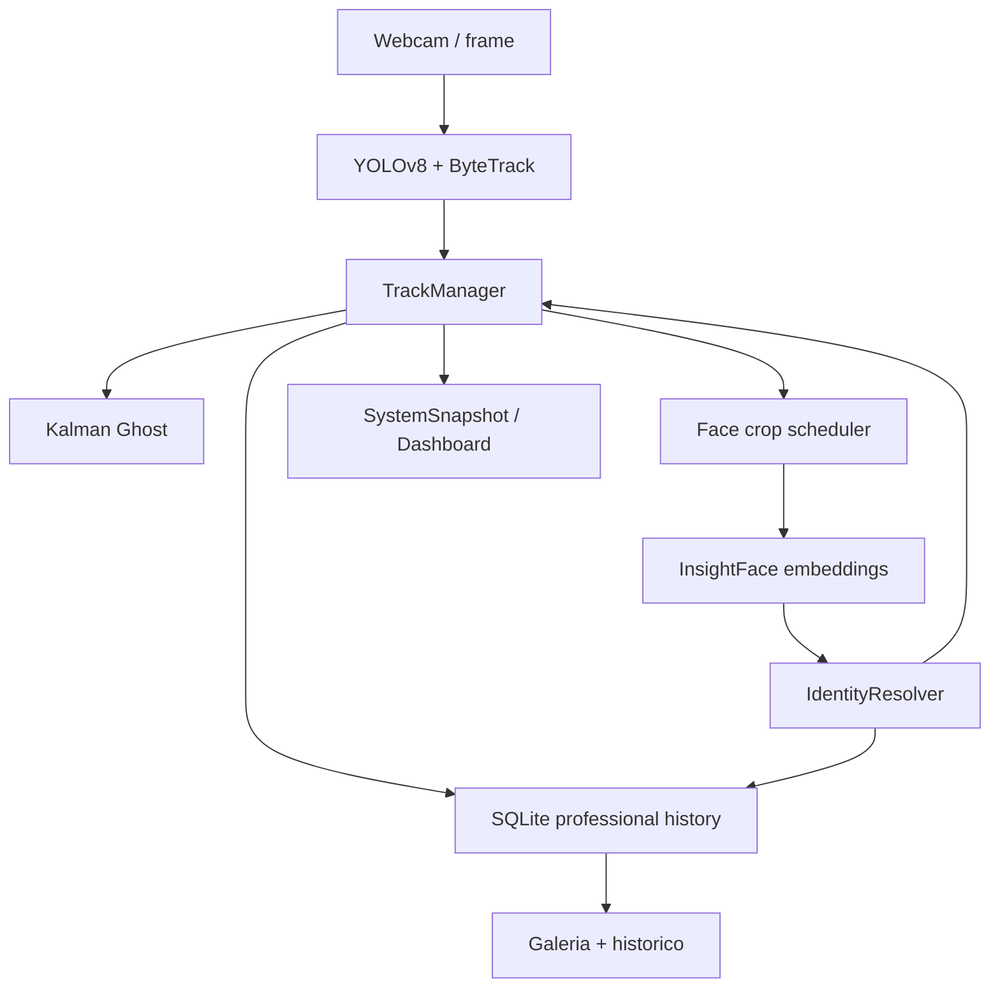

# QUANTUM TRACKER - Arquitetura Tecnica

## Objetivo

Transformar a base atual em uma plataforma modular de identificacao e rastreamento em tempo real.

## Fluxo principal



## Modulos

- `tracker/`: deteccao/tracking visual e estado Ghost.
- `recognition/`: InsightFace, embeddings e resolvedor anti-duplicacao.
- `database/`: SQLite, tabelas profissionais, historico e estatisticas.
- `app/`: UI PySide6.
- `hud/`: desenho OpenCV sobre o frame.
- `core/`: modelos compartilhados.

## Estados de rastreamento

```text
VISIBLE -> OCCLUDED -> GHOST -> LOST -> REMOVED
```

- `VISIBLE`: alvo detectado no frame atual.
- `OCCLUDED`: alvo sumiu por poucos frames, provavelmente oclusao.
- `GHOST`: alvo nao esta visivel, mas posicao/direcao/velocidade sao previstas por Kalman.
- `LOST`: alvo passou da janela confiavel de predicao.
- `REMOVED`: estado interno para limpeza de memoria/sessao.

## Reconhecimento facial

O modulo `recognition/insightface_service.py` usa InsightFace quando disponivel.

No cadastro:

1. Salva foto local.
2. Cria registro em `people`.
3. Extrai embedding facial.
4. Salva `.npy` em `assets/embeddings`.
5. Registra em `face_embeddings`.

No tempo real:

1. Usa bounding box do track.
2. Recorta a pessoa.
3. Detecta rosto no recorte.
4. Gera embedding.
5. Compara por similaridade cosseno.
6. Usa `IdentityResolver` para evitar duplicacao.

## Banco de dados

Tabelas principais:

- `people`
- `face_embeddings`
- `events`
- `track_sessions`
- `track_observations`
- `identity_events`
- `daily_stats`

As tabelas antigas foram preservadas. A migracao e incremental via `CREATE TABLE IF NOT EXISTS`.

## Decisoes tecnicas

- YOLOv8 + ByteTrack permanece como base porque ja estava funcionando.
- InsightFace substitui DeepFace para reduzir custo por frame e usar embeddings consistentes.
- Kalman guarda centro, velocidade, direcao e incerteza.
- SQLite continua adequado para feira cientifica, com historico local e facil copia.
- UI nao deve decidir identidade; ela consome resultados de tracking/reconhecimento.

## Riscos conhecidos

- InsightFace pode exigir instalacao adicional de `insightface` e `onnxruntime`.
- Identificacao facial depende de luz, angulo e nitidez.
- ByteTrack pode trocar IDs quando pessoas se cruzam muito perto.
- Gravar observacoes em todo frame pode crescer o banco; o app grava amostrado a cada 5 frames.

## Melhorias futuras

- Worker/thread separada para reconhecimento facial.
- Reidentificacao corporal.
- Exportacao CSV/PDF.
- Tela de calibracao de limiar facial.
- Backup automatico do banco.
- Empacotamento com PyInstaller.
