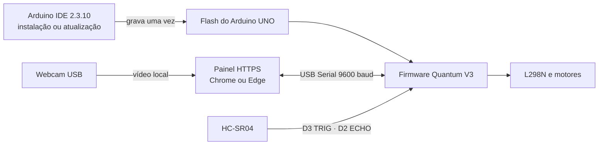

# Quantum Tracker — Arduino UNO, sensor e site

Este documento descreve o fluxo físico validado para o Arduino UNO Rev3, o
L298N, o HC-SR04 e o painel web do Quantum Tracker.

## Resposta curta

O Arduino IDE é usado **uma vez** para compilar e gravar
`firmware/quantum_tracker_arduino/quantum_tracker_arduino.ino` no UNO. O sketch
fica na memória flash do ATmega328P e volta a executar sempre que a placa recebe
energia ou é reiniciada. Ele só precisa ser gravado novamente quando o firmware
for atualizado.

Durante o uso normal, o Arduino IDE e o Monitor Serial devem ficar fechados. O
site abre a mesma porta USB com Web Serial e envia apenas mensagens pequenas,
como `MODE:3` ou `CMD:PARAR`. O site **não recompila nem envia o sketch**.

## O que cada parte executa

### Arduino UNO

- controla IN1–IN4 do L298N;
- mede o HC-SR04;
- executa o desvio de obstáculos;
- mantém `PARAR`, `ESTOP`, falha do sensor e timeout no próprio firmware;
- inicia no Modo 1 e funciona sem computador após a janela segura de boot.

O UNO Rev3 possui ATmega328P, 32 kB de flash, 2 kB de SRAM, USART e interface
USB por ATmega16U2. A compilação atual ocupa uma fração da memória disponível.

### Site no computador

- abre a webcam e executa FaceID ou gestos localmente;
- solicita ao usuário a porta do Arduino;
- confirma o firmware `QT:READY:V5`;
- envia `ESTOP` antes de permitir movimento supervisionado;
- envia modos e comandos e exige confirmação do UNO;
- mostra telemetria, distância, estado e falhas.

Web Serial conecta páginas web a dispositivos seriais, incluindo
microcontroladores ligados por USB. Por segurança, a escolha da porta precisa
partir de um clique do usuário e o painel deve ser aberto em contexto seguro.

### Câmera

A webcam é ligada ao computador, não ao Arduino UNO. O navegador recebe o vídeo
por `getUserMedia()`, processa os quadros e transforma o resultado em comandos
seriais. O Arduino continua usando o HC-SR04 como proteção física mesmo que a
câmera trave ou perca a pessoa.

## Pinagem confirmada

| Arduino UNO | Componente |
|---|---|
| D7 | L298N IN1 |
| D6 | L298N IN2 |
| D5 | L298N IN3 |
| D4 | L298N IN4 |
| D3 | HC-SR04 TRIG |
| D2 | HC-SR04 ECHO |
| 5V | HC-SR04 VCC |
| GND | HC-SR04 GND e GND do L298N |

O HC-SR04 trabalha em 5 V, pede pulso de TRIG com pelo menos 10 µs e informa a
distância pela duração do pulso ECHO. A faixa nominal é de 2 cm a 400 cm; o
firmware rejeita ausência de eco e valores fora dessa faixa.

O L298 é uma ponte H dupla. IN1/IN2 controlam uma ponte e IN3/IN4 controlam a
outra; ENA e ENB precisam estar habilitados. O GND da alimentação dos motores,
o GND do L298N e o GND do Arduino precisam ser comuns.

## Procedimento operacional

1. Desligue as baterias dos motores e deixe as rodas suspensas.
2. No Arduino IDE 2.3.10, selecione **Arduino Uno** e a COM correta.
3. Abra e envie o firmware principal.
4. Feche o Monitor Serial e o Arduino IDE para liberar a COM.
5. Ligue a alimentação correta dos motores.
6. Abra <https://jgouveaf.github.io/FECART/> em Chrome ou Edge no computador.
7. Clique em **Conectar Arduino USB** e escolha a porta do UNO.
8. Aguarde `Firmware V5 confirmado`.
9. Confira rodas, fios e espaço livre; só então clique em
   **Liberar após conferir**.

Ao abrir a serial, muitas placas UNO reiniciam. O firmware mantém os motores
parados por 750 ms após anunciar que está pronto, permitindo que o site confirme
`ESTOP` antes que o Modo 1 possa começar. Sem site conectado, o Modo 1 começa
automaticamente depois dessa janela.

## Alimentação e limitações físicas

- Não alimente os motores pelo pino 5V do Arduino.
- Não injete a alimentação das pilhas no pino 5V do UNO.
- O L298N possui queda de tensão; quatro pilhas Ni-MH de 1,2 V podem deixar
  pouca tensão disponível nos motores após as perdas do driver.
- A eletrônica não corrige bateria fraca, GND ausente, jumper ENA/ENB removido,
  motor ligado em bornes errados ou fio solto.
- Um cabo USB comum limita a distância do carrinho. Para cabos longos, use um
  extensor USB ativo adequado e valide comunicação antes de liberar as rodas.
- O Bluetooth experimental do painel informa proximidade por RSSI; um único
  receptor não fornece direção confiável através de paredes.

## Diagnóstico rápido

| Sintoma | Verificação |
|---|---|
| Arduino IDE informa COM ocupada | Feche o site e qualquer Monitor Serial. |
| Site não consegue abrir a COM | Feche o Arduino IDE/Monitor Serial e reconecte o USB. |
| Firmware incompatível | Grave novamente o Código principal, não os sketches de teste. |
| Nenhum motor gira | Verifique bateria, GND comum, ENA/ENB e rode `teste_motores.ino`. |
| Distância não varia | Confira VCC/TRIG/ECHO/GND e rode `teste_sensor_hcsr04.ino`. |
| Câmera não aparece | Teste no aplicativo Câmera do Windows e permita o site no navegador. |
| Gestos aparecem mas não movem | Conecte o UNO, libere o ESTOP e selecione o Modo 3. |

## Fontes técnicas consultadas

- [Arduino UNO Rev3 — documentação oficial](https://docs.arduino.cc/hardware/uno-rev3/)
- [Arduino UNO Rev3 — datasheet oficial](https://docs.arduino.cc/resources/datasheets/A000066-datasheet.pdf)
- [Arduino CLI — compilação e upload](https://docs.arduino.cc/arduino-cli/getting-started/)
- [Chrome for Developers — Web Serial](https://developer.chrome.com/docs/capabilities/serial)
- [STMicroelectronics — L298](https://www.st.com/en/motor-drivers/l298.html)
- [STMicroelectronics — datasheet do L298](https://www.st.com/resource/en/datasheet/l298.pdf)
- [SparkFun/DigiKey — datasheet do HC-SR04](https://www.digikey.com/en/htmldatasheets/production/3822706/0/0/1/hc-sr04.html)
