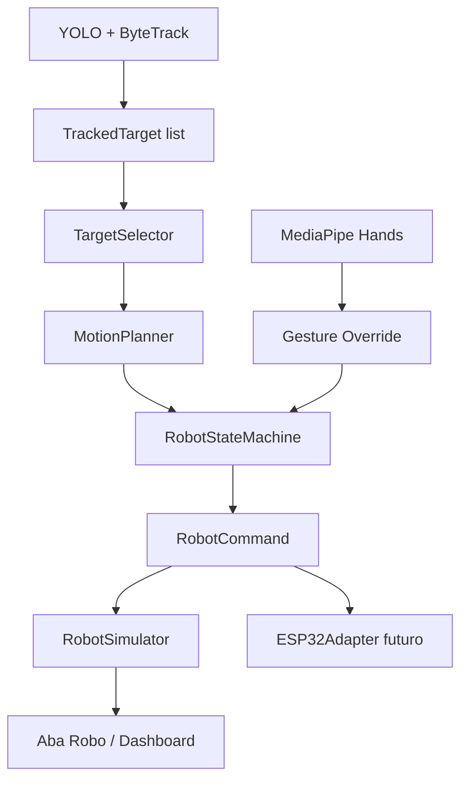

# QUANTUM TRACKER - Software do Robo

Este modulo prepara o cerebro do robo antes da existencia do hardware fisico.

## Arquitetura



## Modulos

- `robot_models.py`: enums, telemetria, comandos e estados.
- `target_selector.py`: trava o alvo escolhido por `track_id`.
- `motion_planner.py`: transforma posicao/distancia do alvo em comando.
- `robot_state_machine.py`: aplica estados e prioridade de gestos.
- `robot_controller.py`: orquestra selecao, movimento, simulador e payload futuro.
- `robot_simulator.py`: simula pose logica do robo.
- `esp32_adapter.py`: prepara payload JSON para integracao futura.

## Estados do Robo

```text
IDLE
FOLLOWING
STOPPED
REVERSE
TURN_LEFT
TURN_RIGHT
GHOST
LOST
```

## Comandos padronizados

```text
FRENTE
PARAR
RE
ESQUERDA
DIREITA
```

## Prioridade de decisao

```text
1. Gesto manual
2. Estado visual LOST/GHOST
3. Planejamento automatico por posicao do alvo
4. Parada segura
```

## Estrategia de movimento

- alvo central e distante: `FRENTE`;
- alvo a esquerda: `ESQUERDA`;
- alvo a direita: `DIREITA`;
- alvo muito proximo: `PARAR`;
- alvo em oclusao curta: `PARAR`;
- alvo em Ghost: comando cauteloso baseado na direcao prevista;
- alvo perdido: `PARAR`.

## Payload futuro ESP32

```json
{
  "command": "FRENTE",
  "state": "FOLLOWING",
  "target_id": 1,
  "speed": 0.45,
  "turn": 0.0
}
```

## Testes recomendados

1. Um alvo no centro deve gerar `FRENTE` se estiver distante.
2. Um alvo a esquerda deve gerar `ESQUERDA`.
3. Um alvo a direita deve gerar `DIREITA`.
4. Um alvo muito perto deve gerar `PARAR`.
5. Gesto `PARAR` deve sobrepor qualquer rastreamento.
6. Gesto `SEGUIR` deve retomar.
7. Se o alvo entrar em `GHOST`, o robo deve entrar em estado `GHOST`.
8. Se o alvo entrar em `LOST`, o comando deve ser `PARAR`.
9. Duas pessoas na cena nao devem trocar o alvo selecionado.
